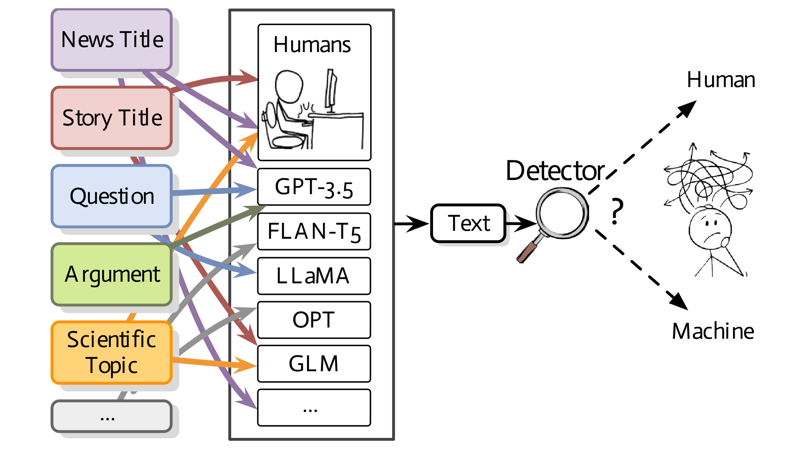

<div align="center">
<p align="center">
  
</p>
</div>

<div align="center">
<h1>MAGE: Machine-generated Text Detection in the Wild</h1>
</div>

<div align="center">
 


<!-- **Authors:** -->
<br>

_**Yafu Li<sup>†</sup><sup>‡</sup>, Qintong Li<sup>§</sup>, Leyang Cui<sup>¶</sup>, Wei Bi<sup>¶</sup>,Zhilin Wang<sup>$</sup><br>**_

_**Longyue Wang<sup>¶</sup>, Linyi Yang<sup>‡</sup>, Shuming Shi<sup>¶</sup>, Yue Zhang<sup>‡</sup><br>**_

<!-- **Affiliations:** -->

_<sup>†</sup> Zhejiang University,
<sup>‡</sup> Westlake University,
<sup>§</sup> The University of Hong Kong,
<sup>$</sup> Jilin University,
<sup>¶</sup> Tencent AI Lab_

Presenting a comprehensive benchmark dataset designed to assess the proficiency of AI-generation detectors amidst real-world scenarios.
Welcome to try detection via our **[online demo](https://detect.westlake.edu.cn)**!

</div>

## 📌 Table of Contents

- [Introduction](#-introduction)
- [Activities](#-activities)
- [Dataset](#-dataset)
- [Try Detection](#computer--try-detection)
- [Data Samples](#-data-samples)
- [Citation](#-citation)
<!-- - [Contributing](#-contributing) -->

## 🚀 Introduction

Recent advances in large language models have enabled them to reach a level of text generation comparable to that of humans.
These models show powerful capabilities across a wide range of content, including news article writing, story generation, and scientific writing.
Such capability further narrows the gap between human-authored and machine-generated texts, highlighting the importance of machine-generated text detection to avoid potential risks such as fake news propagation and plagiarism.
In practical scenarios, the detector faces texts from various domains or LLMs without knowing their sources.

To this end, we build **a comprehensive testbed for deepfake text detection**, by gathering texts from various human writings and deepfake texts generated by different LLMs.
This repository contains the data to testify deepfake detection methods described in our paper, [MAGE: Machine-generated Text Detection in the Wild](https://aclanthology.org/2024.acl-long.3/).
Welcome to test your detection methods on our testbed!

## 📅 Activities

- 🎉 **May 16, 2024**: Our paper was accepted by ACL 2024!
- 🎉 **June 19, 2023**: Update two 'wilder' testbeds! We go one step wilder by constructing an additional testset with texts from unseen domains generated by an unseen model, to testify the detection ability in more practical scenarios.
  We consider four new datasets: CNN/DailyMail, DialogSum, PubMedQA and IMDb to test the detection of deepfake news, deepfake dialogues, deepfake scientific answers and deepfake movie reviews.
  We sample 200 instances from each dataset and use a newly developed LLM, i.e., GPT-4, with specially designed prompts to create deepfake texts, establishing an "Unseen Domains & Unseen Model" scenario.
  Previous work demonstrates that detection methods are vulnerable to being deceived by target texts.
  Therefore, we also paraphrase each sentence individually for both human-written and machine-generated texts, forming an even more challenging testbed.
  We adopt gpt-3.5-trubo as the zero-shot paraphraser and consider all paraphrased texts as machine-generated.
- May 25, 2023: Initial dataset release including texts from 10 domains and 27 LLMs, contributing to 6 testbeds with increasing detection difficulty.

## 📝 Dataset

The dataset consists of **447,674** human-written and machine-generated texts from a wide range of sources in the wild:

- Human-written texts from **10 datasets** covering a wide range of writing tasks, e.g., news article writing, story generation, scientific writing, etc.
- Machine-generated texts generated by **27 mainstream LLMs** from 7 sources, e.g., OpenAI, LLaMA, and EleutherAI, etc.
- **8 systematic testbed**s with increasing wildness and detection difficulty.

### 📥 How to Get the Data

#### 1. Huggingface

You can access the full dataset, which includes the Cross-domains & Cross-models testbed and two additional wilder test sets, through the [Huggingface API](https://huggingface.co/datasets/yaful/MAGE):

```python
from datasets import load_dataset
dataset = load_dataset("yaful/MAGE")
```

which includes traditional splits (train.csv, valid.csv and test.csv) and two wilder test sets (test_ood_set_gpt.csv and test_ood_set_gpt_para.csv).
The csv files have three columns: text, label (0 for machine-generated and
1 for human-written) and text source information (e.g., ''cmv_human'' denotes the text is written by humans,
whereas ''roct_machine_continuation_flan_t5_large'' denotes the text is generated by ''flan_t5_large'' using continuation prompt).

To obtain the 6 testbeds mentioned in our paper, simply apply the provided script:

```shell
python3 deployment/prepare_testbeds.py DATA_PATH
```

Replace ''DATA_PATH'' with the output data directory where you want to save the 6 testbeds.

#### 2. Cloud Drive

Alternatively, you can access the 6 testbeds by downloading them directly through [Google Drive](https://drive.google.com/drive/folders/1p09vDiEvoA-ZPmpqkB2WApcwMQWiiMRl?usp=sharing)
or [Tencent Weiyun](https://share.weiyun.com/JUWQxF4H)：

The folder contains 4 packages:

- testbeds_processed.zip: 6 testbeds based on the ''processed'' version, which can be directly used for detecting in-distribution and out-of-distribution detection performance.
- wilder_testsets.zip: 2 wilder test sets with texts processed, aiming for (1) detecting deepfake text generated by GPT-4, and (2) detecting deepfake text in paraphrased versions.
- source.zip: Source texts of human-written texts and corresponding texts generated by LLMs, without filtering.
- processed.zip: This is a refined version of the "source" that filters out low-quality texts and specifies sources as CSV file names. For example, the "cmv_machine_specified_gpt-3.5-trubo.csv" file contains texts from the CMV domain generated by the "gpt-3.5-trubo" model using specific prompts, while "cmv_human" includes human-written CMV texts.

## :computer: Try Detection

### Python Environment

For deploying the Longformer detector or training your own detector using our data, simply install the following packages:

```shell
pip install transformers
pip install datasets
pip install clean-text # for data preprocessing
```

Or you can run:

```shell
pip install -r requirements.txt
```

### Model Access

Our Longformer detector, which has been trained on the entire dataset, is now accessible through [Huggingface](https://huggingface.co/yaful/MAGE). Additionally, you can try detection directly using our [online demo](https://detect.westlake.edu.cn/).

###

We have refined the decision boundary based on out-of-distribution settings. To ensure optimal performance, we recommend preprocessing texts before sending them to the detector.

```python
import torch
import os
from transformers import AutoModelForSequenceClassification,AutoTokenizer
from deployment import preprocess, detect

# init
device = 'cpu' # use 'cuda:0' if GPU is available
# model_dir = "nealcly/detection-longformer" # model in our paper
model_dir = "yaful/MAGE" # model in the online demo
tokenizer = AutoTokenizer.from_pretrained(model_dir)
model = AutoModelForSequenceClassification.from_pretrained(model_dir).to(device)

text = "Apple's new credit card will begin a preview roll out today and will become available to all iPhone owners in the US later this month. A random selection of people will be allowed to go through the application process, which involves entering personal details which are sent to Goldman Sachs and TransUnion. Applications are approved or declined in less than a minute. The Apple Card is meant to be broadly accessible to every iPhone user, so the approval requirements will not be as strict as other credit cards. Once the application has been approved, users will be able to use the card immediately from the Apple Wallet app. The physical titanium card can be requested during setup for free, and it can be activated with NFC once it arrives."
# preprocess
text = preprocess(text)
# detection
result = detect(text,tokenizer,model,device)
```

### Detection Performance

#### In-distribution Detection

| Testbed                              | HumanRec | MachineRec | AvgRec | AUROC |
| ------------------------------------ | -------- | ---------- | ------ | ----- |
| White-box                            | 97.30%   | 95.91%     | 96.60% | 0.99  |
| Arbitrary-domains & Model–specific   | 95.25%   | 96.94%     | 96.60% | 0.99  |
| Fixed-domain & Arbitrary-models      | 89.78%   | 97.24%     | 93.51% | 0.99  |
| Arbitrary-domains & Arbitrary-models | 82.80%   | 98.27%     | 90.53% | 0.99  |

#### Out-of-distribution Detection

| Testbed           | HumanRec | MachineRec | AvgRec | AUROC |
| ----------------- | -------- | ---------- | ------ | ----- |
| Unseen Model Sets | 83.31%   | 89.90%     | 86.61% | 0.95  |
| Unseen Domains    | 38.05%   | 98.75%     | 68.40% | 0.93  |

#### Wilder Testsets

| Testbed                       | HumanRec | MachineRec | AvgRec | AUROC |
| ----------------------------- | -------- | ---------- | ------ | ----- |
| Unseen Domains & Unseen Model | 88.78%   | 84.12%     | 86.54% | 0.94  |
| Paraphrase                    | 88.78%   | 37.05%     | 62.92% | 0.75  |

## 📄 Data Samples

All instances are stored as rows in a csv format, with each row consiting of 3 columns: _Text_, _Label_ (0 for machine-generated and 1 for human-written) and _Index_ (indexes in the original data source, used restore alignment after filtering).

#### News Article

| Text                                                                                                                                                                                                                                                                                                                                                                                                                                                                                                                                                                                                                                                                                                                                                                                                                                                                                                                                                                                                                                                                                                                                                             | Label |
| ---------------------------------------------------------------------------------------------------------------------------------------------------------------------------------------------------------------------------------------------------------------------------------------------------------------------------------------------------------------------------------------------------------------------------------------------------------------------------------------------------------------------------------------------------------------------------------------------------------------------------------------------------------------------------------------------------------------------------------------------------------------------------------------------------------------------------------------------------------------------------------------------------------------------------------------------------------------------------------------------------------------------------------------------------------------------------------------------------------------------------------------------------------------- | ----- |
| Apple's new credit card will begin a preview roll out today and will become available to all iPhone owners in the US later this month. A random selection of people will be allowed to go through the application process, which involves entering personal details which are sent to Goldman Sachs and TransUnion. Applications are approved or declined in less than a minute. The Apple Card is meant to be broadly accessible to every iPhone user, so the approval requirements will not be as strict as other credit cards. Once the application has been approved, users will be able to use the card immediately from the Apple Wallet app. The physical titanium card can be requested during setup for free, and it can be activated with NFC once it arrives.                                                                                                                                                                                                                                                                                                                                                                                         | 1     |
| Apple's new credit card will begin a preview roll out today and will become available to all iPhone owners in the US later this month. A random selection of people who applied for an Apple Card beta account last week will be sent invitations just before April 26, when everyone else can start using it too. The Apple Card is designed with privacy in mind: users aren't able to link their cards or view detailed transaction histories online as some other services do. The app itself also stores no personal data on your phone, only a virtual version in its secure payment system so you don't have to give Apple access to any sensitive details. It uses machine learning-based algorithms that learn from how you spend to provide personalized recommendations about your spending habits. Your transactions are stored offline on your device, the company says, while information like email addresses remains encrypted during transit between your devices and the cloud. And if you ever lose your physical card, Apple has said there's a way to temporarily disable the card without affecting payments until the actual one arrives. | 0     |
| Today marks the beginning of a new era of financial technology: Apple Card is now available to all users in the United States. The long-awaited credit card from Apple, which was announced earlier this year, is now available for everyone to sign up and use. With features such as cashback on purchases and robust security measures, Apple Card could revolutionize how people make payments. This could be the start of a new wave of digital payment options.                                                                                                                                                                                                                                                                                                                                                                                                                                                                                                                                                                                                                                                                                            | 0     |

#### Opinion Statement

| Text                                                                                                                                                                                                                                                                                                                                                                                                                                                                                                                                                                                                                                                                                                                                                                                                                                                                                                                                                                                                                                                                                                                                                                                                                                                                                                                                                                                                                                                                                                                                                                                                                                                                                                                                                                                                                                                                                                                                                                                                                                                                                                                                                                                                                                                                                                                                                                                                                                                                                                                                                                                                                                                                                                                                                                                                                                                                                                                                                                                                                                                          | Label |
| ------------------------------------------------------------------------------------------------------------------------------------------------------------------------------------------------------------------------------------------------------------------------------------------------------------------------------------------------------------------------------------------------------------------------------------------------------------------------------------------------------------------------------------------------------------------------------------------------------------------------------------------------------------------------------------------------------------------------------------------------------------------------------------------------------------------------------------------------------------------------------------------------------------------------------------------------------------------------------------------------------------------------------------------------------------------------------------------------------------------------------------------------------------------------------------------------------------------------------------------------------------------------------------------------------------------------------------------------------------------------------------------------------------------------------------------------------------------------------------------------------------------------------------------------------------------------------------------------------------------------------------------------------------------------------------------------------------------------------------------------------------------------------------------------------------------------------------------------------------------------------------------------------------------------------------------------------------------------------------------------------------------------------------------------------------------------------------------------------------------------------------------------------------------------------------------------------------------------------------------------------------------------------------------------------------------------------------------------------------------------------------------------------------------------------------------------------------------------------------------------------------------------------------------------------------------------------------------------------------------------------------------------------------------------------------------------------------------------------------------------------------------------------------------------------------------------------------------------------------------------------------------------------------------------------------------------------------------------------------------------------------------------------------------------------------- | ----- |
| Look, I know this is a touchy subject, and while people might say I'm young and didn't understand the complexity of wars, just hear me out. Vietnam was essentially a communist state, due to influences from China and USSR, which were alliances (the former is debatable) of Vietnam during the war. After the war, our country has suffered multiple economic depressions, and famines due to the incompetence of our liberally named Communist Party. Granted the South Vietnam government wasn't any better, but what the U.S wanted for Vietnam was for the best. I understand that, technically the US did not wage war with our people, but stood against the spread of communism in Asia, and with our strategic location, a battle surely followed. The US did not deliberately invaded our country. And look at what they did to the world. Defeated the Nazis and fascist countries, uplifted South Korea, Japan (which were both smaller and less resourceful than my country) to their respectable position on the world map today. And what had the sole communist party in my country done? Nothing but left our people in the struggle of a third-world country. And China is still brazenly harassing our borders and seas to this very day, just because our army is incapable of standing up for themselves. Please tell me if I was wrong and why the North won was a good idea. Edit: My view has changed. It was not simple as I thought it was. Generally it can be summarized into those points: involvement of China, motives and war crimes committed by the US, and there was no hope in the governing system. Communism has not helped our people a bit, but no one can really advocates for America either. We as a nation should look to develop our own path. Insights are still very much appreciated. And thanks for the discussions.                                                                                                                                                                                                                                                                                                                                                                                                                                                                                                                                                                                                                                                                                                                                                                                                                                                                                                                                                                                                                                                                                                                                                                                      | 1     |
| Look, I know this is a touchy subject, and while people might say I'm young and didn't understand the complexity of wars, just hear me out. Vietnam was essentially a lost war. A war where we fought against the communists, but lost, after years of fighting and thousands of lives lost. We were a technologically advanced nation, but outmatched by the communists who were determined to destroy us. And they almost did. So when I think about Iraq, I can't help but compare it to Vietnam. And the only thing I'm seeing is our forces being put in a situation where they can't win. Let's start with the weapons. I'm not a weapons expert by any means, so I don't know all the fine details. But the simple facts are this: the communists had the Russians, and we had the U.S. (and other allies). Well, the communists have just as many weapons as we have, if not more. I understand that we can win by outnumbering them, but that is very difficult. Most likely we will have to use sophisticated weapons, but then we get into the tricky area of international law. Can you really justify dropping a bomb on a country that has a pretty advanced military force (think of North Korea, for example)? The answer might be yes, because if you don't do that you're handing the war to them, but then you have to ask yourself if you really want to start that slippery slope. Now there are some people who think that if we just let the terrorists have their way with us, then we will send a message to the world. Well, if that's the case, then what about the message we send by having weapons that are supposedly sophisticated enough to kill entire countries? You can't send a message by allowing innocent people to die, and if you want to kill innocent people, then you might as well start killing people at home. So there are people who say we should use these weapons in Iraq, and there are others who say we shouldn't, and there are the people who have their own ideas. But the one thing I know is this: we are in a very difficult position. We don't have the technology to back up our claims that we are the good guys, and we don't want to lose by being outmatched, so the only thing we can do is back out of the war. But this brings up a very interesting point. I wonder if Bush, who has been preaching against the communists, is going to back out of Iraq. And if he doesn't, what kind of message does that send? I know that he wants to send a message to the rest of the world, but do we really want to send that message? If we do, then what about the message we send by supporting one of the richest nations in the world, and supporting war that many of us don't even want? I know that many of you disagree with me, and I'm sorry if this is rude, but I'm just trying to get people to think. I'm not trying to be mean, and I know that I'm not right, but at least I have something to say. I know that I can't change anything, but I know that I can at least try. | 0     |
| It is understandable that you may wish the United States had won the Vietnam War, however, it is important to recognize that the Vietnam War was a complex conflict with many political and social implications. In reality, it is impossible to predict what would have happened if the U.S. had won the war. The war could have potentially resulted in more loss of life and suffering for the Vietnamese people. It is also important to consider that the war united the Vietnamese people and eventually led to the reunification of Vietnam in 1976, which could not have occurred if the U.S. had been victorious. Therefore, while it can be tempting to look back on history and wish for a different outcome, it is important to recognize the complexities of the Vietnam War and the positive outcomes that have come from it.                                                                                                                                                                                                                                                                                                                                                                                                                                                                                                                                                                                                                                                                                                                                                                                                                                                                                                                                                                                                                                                                                                                                                                                                                                                                                                                                                                                                                                                                                                                                                                                                                                                                                                                                                                                                                                                                                                                                                                                                                                                                                                                                                                                                                   | 0     |

#### Long-form Answer

| Text                                                                                                                                                                                                                                                                                                                                                                                                                                                                                                                                                                                                                                                                                                                                                                                                                                                                                                                                                                                                                                                                                                                                                                                                                                                                                                                                                                                                                                                                                                                                                                                                                                                                                                                                                                                                                                                                                                                                                                                                                                                                                                                                                                                                                                                                                                                                                                                                                                                                                                                                                                                                                                                                                                                                          | Label |
| --------------------------------------------------------------------------------------------------------------------------------------------------------------------------------------------------------------------------------------------------------------------------------------------------------------------------------------------------------------------------------------------------------------------------------------------------------------------------------------------------------------------------------------------------------------------------------------------------------------------------------------------------------------------------------------------------------------------------------------------------------------------------------------------------------------------------------------------------------------------------------------------------------------------------------------------------------------------------------------------------------------------------------------------------------------------------------------------------------------------------------------------------------------------------------------------------------------------------------------------------------------------------------------------------------------------------------------------------------------------------------------------------------------------------------------------------------------------------------------------------------------------------------------------------------------------------------------------------------------------------------------------------------------------------------------------------------------------------------------------------------------------------------------------------------------------------------------------------------------------------------------------------------------------------------------------------------------------------------------------------------------------------------------------------------------------------------------------------------------------------------------------------------------------------------------------------------------------------------------------------------------------------------------------------------------------------------------------------------------------------------------------------------------------------------------------------------------------------------------------------------------------------------------------------------------------------------------------------------------------------------------------------------------------------------------------------------------------------------------------- | ----- |
| That is called bootstrap problem. How can you program something when no software exists that lets you program things. And how can a computer read what to do, if it doesn't know how to read. The answer is that you have to write a really simple program yourself, onto the hardware. It never changes for a computer, and is used every time you turn it on. That tiny program doesn't do anything except tell every part of the computer what it is and where it can get the stuff it needs. This includes really basic stuff, like storage adresses and and how to read them. From then on, the hardware can look up how to use the screen, how to read the keyboard, all those things. It's of course a bit more complicated than that, but once you have that first spark going, you can build up on that and program away.,We did use keyboards. They just weren't connected to the computer. You typed in your command on what was basically a typewriter which then"punched" the information onto cards. These were known as Hollerith Punch Cards - the machine looked like this: URL0 You then took the stack of cards very carefully to the computer hopper and fed them in. They had to stay in the same order they were punched for your program to work.', "Originally, computers were little more than some cathodes connected by cables. Programming them was done by changing the connections. A little later, computers had readers that took in cards with holes in certain distances, serving as binary input. I imagine.the first keyboard simply used that reader's interface,Well, for a pretty user-friendly way, there's the original [Altair 8800] (URL1). Note the switches on the front; when entering a program, you would set them to a position representing a number representing an operation of the computer, then press a button to store it in the memory and proceed to the next position. When you were done you'd press some other button to start the program you just "typed." Of course, all would be lost when you turned off the power.', "Via use of physical digital circuitry. I kid you not. As a project for an introductory course to digitial systems we had to make a ping pong game explicitly from digital circuits using specific IC's (and the basic NOTXORORAND gate IC's only). There was no code whatsoever in this system. Once you manage that, everything else is easy.,Punched cards preceded computers by [decades] (URL2). They could be used with sorters and counters to answer fairly sophisticated questions, as long as the data fit on the card. When business computers become useful they had the cards and the keyboards used to fill them out ready and waiting. | 1     |
| The original programmers probably used a different way to make the computer do what they wanted it to do because keyboards did not exist yet. They might have used a different type of machine to give commands, or they might have used punch cards or other methods to write down instructions that the computer could understand. The keyboard was invented later to make it easier and faster for people to tell a computer what to do.                                                                                                                                                                                                                                                                                                                                                                                                                                                                                                                                                                                                                                                                                                                                                                                                                                                                                                                                                                                                                                                                                                                                                                                                                                                                                                                                                                                                                                                                                                                                                                                                                                                                                                                                                                                                                                                                                                                                                                                                                                                                                                                                                                                                                                                                                                   | 0     |
| That is called bootstrap problem. How can you program something when no software exists that lets you program things. And how can a computer read what to do, if it has no instructions to begin with? One possible solution to the bootstrap problem is to start with a set of very basic instructions written in machine language (the language that computers speak), and use those instructions to build more complex instructions and programs. This process is also known as bootstrapping or self-hosting. For example, a programmer could start with the most basic machine instructions to add, subtract, and compare numbers, and then use those instructions to create more complex operations like conditional statements, loops, and functions. Over time, more complex programs and programming languages can be built upon this foundation. Another solution is to use a pre-existing programming language or tool to create the initial instructions or software needed to bootstrap a new system. This approach is common in the development of operating systems, where code is initially written in a higher-level language like C, and then compiled into machine code that can be run on a computer. Overall, there are several ways to approach the bootstrap problem, and the solution will typically depend on the specific goals and constraints of the project.                                                                                                                                                                                                                                                                                                                                                                                                                                                                                                                                                                                                                                                                                                                                                                                                                                                                                                                                                                                                                                                                                                                                                                                                                                                                                                                                                     | 0     |

#### Story Generation

| Text                                                                                                                                                                                                                                                                                                                                                                                                                                                                                                                                                                                                                                                                                                                                                                                                                                                                                                                                                                                                                                                                                                                                                                                                                                                                                                                                                                                                                                                                                                       | Label |
| ---------------------------------------------------------------------------------------------------------------------------------------------------------------------------------------------------------------------------------------------------------------------------------------------------------------------------------------------------------------------------------------------------------------------------------------------------------------------------------------------------------------------------------------------------------------------------------------------------------------------------------------------------------------------------------------------------------------------------------------------------------------------------------------------------------------------------------------------------------------------------------------------------------------------------------------------------------------------------------------------------------------------------------------------------------------------------------------------------------------------------------------------------------------------------------------------------------------------------------------------------------------------------------------------------------------------------------------------------------------------------------------------------------------------------------------------------------------------------------------------------------- | ----- |
| Thomas loves science fiction, and is pleased to find himself sitting by the park entrance with Arthur C. Clarke's " Fountains of Paradise " open in his lap. He must have jogged there, he thinks to himself as he admires his brand new black-and-white Nikes. He stretches out in his black joggers and turns the page. " But there was no substitute for reality, one should beware of imitations ," he reads before shutting the book. Thomas ponders what he has read as he looks to the right; not a single car can be seen. The street appears infinite in length and the buildings fade in to the distance with it. He stands and begins his first step down the street. His movement halts when he hears a young voice behind him, " You look thirsty mister. Would you like some lemonade? " Thomas walks back past the park entrance and over to the lemonade stand, wondering how he had not noticed it before. It is beautiful, the entrance; but the park is closed now. Thomas stares up at the gates in awe. Thomas is interrupted again by the child, " 5.50, please. " Thomas looks at the counter, flustered. " I'll have the punch instead. " As the child pours the purple drink in to the cup, Thomas reaches in his pocket finding a five dollar bill and three quarters. " Keep the change ," Thomas says as he picks up his drink. Thomas sips and the sky slowly dims. He feels his breath drawn away from him as a comet sails over the park entrance. And Heaven's Gate opens. | 1     |
| Thomas loves science fiction, and is pleased to find himself sitting by the park entrance with Arthur C. Clarke's " Fountains of Paradise " open in his lap. He must have been reading for quite a while, as it's getting dark, and the other night-time park visitors are beginning to emerge. He gets up to leave, and on his way out finds a very tiny boy walking around in circles, trying to find his parents. The little boy is quite distressed, and Thomas takes him to the park office, which is locked. Thomas finally remembers that he's got a cell phone in his pocket, and calls the number on the sign. The woman on the other end is very kind, and promises to come help the boy right away. Thomas is pleased to have been able to help, and heads off to the train station to go home. On the train, his eyes are tired, and he falls asleep. At the end of the chapter, we find out that the woman on the phone was the boy's grandmother. The boy was seven years old, and his parents had taken him to the park for a picnic. The boy had started walking around in circles when he couldn't find his mother and father again.                                                                                                                                                                                                                                                                                                                                                      | 0     |
| Jeff was a normal guy, living a normal life. He had a family, a job, and a few friends. But above all else, he wasn't religious. He rarely thought about religion, and when he did, it was with a kind of apathy. One day, Jeff died unexpectedly. He woke up in an unfamiliar place, surrounded by people he didn't know. He was confused, but no one seemed to mind. As he looked around, Jeff noticed that everyone was dressed differently and speaking different languages. Then it hit him - he had died and gone to the afterlife. But something else struck him: none of these people were from his own religion. In fact, he didn't recognize any of the religions here. Then it dawned on him - this wasn't the afterlife of his religion, it was the afterlife of the religion whose tenets he had followed most closely, knowingly or not. He had lived his life without being religious, but had unknowingly followed a certain set of beliefs. Now, in the afterlife, he was among those who had done the same. Jeff found himself feeling strangely comforted in this new place. He realized that even though his faith had been different than others', its core values were still very much the same. This newfound understanding filled Jeff with peace and joy, and he felt like he had really come home.                                                                                                                                                                               | 0     |

#### Scientific Writing

| Text                                                                                                                                                                                                                                                                                                                                                                                                                                                                                                                                                                                                                                                                                                                                                                                                                                                                                                                                                                                                                                                                                                                                                                                                                                              | Label |
| ------------------------------------------------------------------------------------------------------------------------------------------------------------------------------------------------------------------------------------------------------------------------------------------------------------------------------------------------------------------------------------------------------------------------------------------------------------------------------------------------------------------------------------------------------------------------------------------------------------------------------------------------------------------------------------------------------------------------------------------------------------------------------------------------------------------------------------------------------------------------------------------------------------------------------------------------------------------------------------------------------------------------------------------------------------------------------------------------------------------------------------------------------------------------------------------------------------------------------------------------- | ----- |
| Although deep-learning-based methods have markedly improved the performance of speech separation over the past few years, it remains an open question how to integrate multi-channel signals for speech separation. We propose two methods, namely, early-fusion and late-fusion methods, to integrate multi-channel information based on the time-domain audio separation network, which has been proven effective in single-channel speech separation. We also propose channel-sequential-transfer learning, which is a transfer learning framework that applies the parameters trained for a lower-channel network as the initial values of a higher-channel network. For fair comparison, we evaluated our proposed methods using a spatialized version of the wsj0-2mix dataset, which is open-sourced. It was found that our proposed methods can outperform multi-channel deep clustering and improve the performance proportionally to the number of microphones. It was also proven that the performance of the late-fusion method is consistently higher than that of the single-channel method regardless of the angle difference between speakers.                                                                                    | 1     |
| Although deep learning has achieved appealing results on several machine learning tasks, most of the models are deterministic at inference, limiting their application to single-modal settings. We propose a novel probabilistic deep learning model, namely Probabilistic Interpretation Network (PIN), which enables multi-modal inference, uncertainty quantification, and sample-based exploration by extracting latent representations from multiple modalities (e.g. vision and language) and modeling their dependencies via a probabilistic graphical model. PIN is a flexible framework that can be used to train interpretable multi-modal models as well as handle modalities in an unsupervised setting. We apply PIN to a wide variety of tasks including out-of-distribution detection, visual question answering and goal-driven dialogue. We present a new evaluation metric for goal-driven dialogue and show that PIN is capable of handling both modalities and uncertainty in this setting.                                                                                                                                                                                                                                  | 0     |
| Although deep learning has achieved appealing results on several machine learning tasks, most of the models are deterministic at inference, limiting their application to single-modal settings. We propose a novel approach that allows to perform probabilistic inference with deep learning models. Our method is based on a variational autoencoder (VAE) and uses a mixture of Gaussians as a prior distribution for the latent variable. The VAE is trained by maximising a variational lower bound on the data log-likelihood, which can be seen as an evidence lower bound (ELBO). We introduce a novel approach to learn this ELBO, which is based on the re-parameterisation trick. This trick allows us to use standard gradient descent techniques to optimise the ELBO and consequently obtain a probabilistic latent representation for the data. We evaluate our model on a variety of datasets, including images, text, and speech. Our results show that our approach achieves comparable performance to existing deterministic models, while providing a probabilistic interpretation of the input data. Moreover, we demonstrate that our approach yields better generalisation ability when compared to deterministic models. | 0     |

## 📚 Citation

If you use this dataset in your research, please cite it as follows:

```bibtex
@inproceedings{li-etal-2024-mage,
    title = "{MAGE}: Machine-generated Text Detection in the Wild",
    author = "Li, Yafu  and
      Li, Qintong  and
      Cui, Leyang  and
      Bi, Wei  and
      Wang, Zhilin  and
      Wang, Longyue  and
      Yang, Linyi  and
      Shi, Shuming  and
      Zhang, Yue",
    editor = "Ku, Lun-Wei  and
      Martins, Andre  and
      Srikumar, Vivek",
    booktitle = "Proceedings of the 62nd Annual Meeting of the Association for Computational Linguistics (Volume 1: Long Papers)",
    month = aug,
    year = "2024",
    address = "Bangkok, Thailand",
    publisher = "Association for Computational Linguistics",
    url = "https://aclanthology.org/2024.acl-long.3",
    doi = "10.18653/v1/2024.acl-long.3",
    pages = "36--53",
}
```

We welcome contributions to improve this dataset! If you have any questions or feedback, please feel free to reach out at yafuly@gmail.com.
